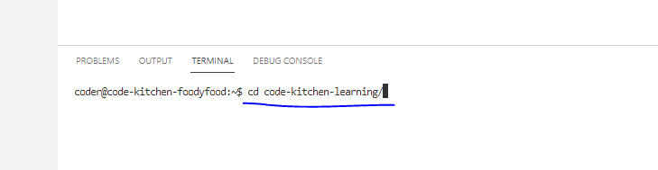

# Code Kitchen - Learning To Make a Website

This repository will be used on a learning platform I've made for my friends.

The curent contents is step 1 of learning web development.

### How to fetch these files

Copy and paste the following into this area:


```bash
git clone https://github.com/FoodyFood/code-kitchen-learning.git
```
Then press 'enter'.

You will now see the files on the left in the file browsing area.


<br>

### Starting The Website

To let our website be seen by the public, we need to serve the website.

We need to do 2 things to get our website serving.



```bash
cd code-kitchen-learning/
```
Then press enter.

Next we type the following and press enter like before.

```bash
make website
```

Now your website should be getting served to the world.

### Where can I see it

In the following link, replace '/user/foodyfood' with your own username:
https://code-kitchen.foodyfood.cloud/user/foodyfood/proxy/8000

For example, here is one for the user jimbeam:
https://code-kitchen.foodyfood.cloud/user/jimbeam/proxy/8000

### Editing The Website

Double click the file called 'index.html' inside the code-kitchen-learning folder on the left.

In here you will see some text, try changing it, then refresh the tab you opened your link in. 

Congratulations, you just made and edited a website.

Try adding some more paragraphs, try googling ''how to make text bold in a html webpage'' to see how to make things bold.

Try adding this code at the bottom to add a picture:

```html

```

And always reach out if you need help or get stuck!