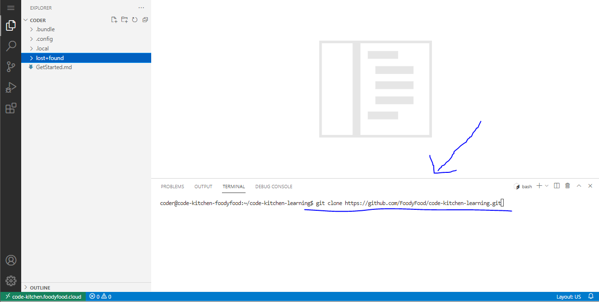

# Code Kitchen - Learning To Make a Website

This repository will be used on a learning platform I've made for my friends.

The curent contents is step 1 of learning web development.

### How to fetch these files

Copy and paste the following into this area:




```bash
git clone https://github.com/FoodyFood/code-kitchen-learning.git
```
Then press 'enter'.

<br>

You will now see the files on the left in the file browsing area.


